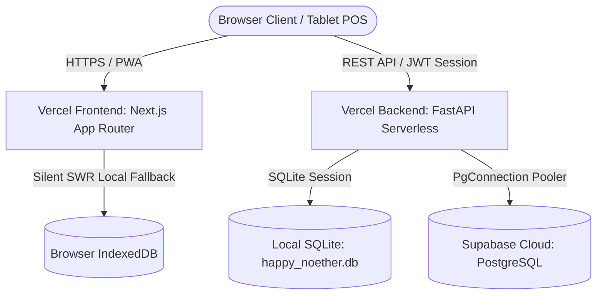

# H+H Operations Hub — ERP Portfolio Demo

Welcome to the public portfolio demonstration copy of **H+H Hub** (Handmade+Homemade), a fully-featured, customized Enterprise Resource Planning (ERP) and operations management platform.

### 🌐 [Open Live Demo Application](https://food-operations-erp-demo.vercel.app)

---

## 🔑 Demo Sandbox Access

Experience the active system workflows directly using our dedicated public sandbox credentials:

| Role Account | Username | Passcode | Allowed Scope & Permissions |
|---|---|---|---|
| **Demo Owner** | `demo-owner` | `owner123` | **Full access**: Recipe costing, DFS margin analytics, administrative overrides, and system settings. |
| **Demo Staff** | `demo-staff` | `staff123` | **Restricted operations**: Cost-redacted Station view showing checklists, cooking targets, and pop-up market dispatches. |

> **⚠️ SAFETY WARNINGS**:
> * **All data is 100% synthetic**: All products, margins, prices, supplier identities, and financial metrics are simulation records and do not reflect any real-world entities.
> * **Privacy Warning**: This is a public portfolio sandbox and resets regularly. **Do not enter real business or personal information** inside any inputs.

---

## ⚠️ Portfolio Sandbox Disclaimer

> **IMPORTANT**: This repository is a sanitized, public portfolio demonstration copy of a private, production system. To protect commercial privacy, all proprietary recipes, supplier contacts, physical addresses, customer listings, local server environments, and real financial margins have been completely removed and replaced with realistic synthetic records.
> 
> * No production Supabase/database hosts or credentials are used.
> * A fail-closed security guard automatically blocks connection attempts to known production hosts in demo/sandbox modes.
> * Visitors can try out normal operational workflows without seeing or changing any production corporate information.

---

## 🥪 Executive Overview & Problem Solved

Traditional boutique food manufacturing and pop-up retail operations often rely on interconnected, fragile, and error-prone spreadsheet setups (Google Sheets) to coordinate their logistics. This manual coordination leads to major inefficiencies:
1. **Unsynchronized Inventory**: Kitchen consumption and warehouse SKUs drift out of sync.
2. **Double-counting & cost drift**: Packaging materials are repeatedly counted in recipe BOMs, throwing off profit calculations.
3. **Cashier POS Double-Submissions**: Unstable internet at pop-up bazaars causes cashiers to double-submit POS transactions, creating audit and tax discrepancies.
4. **Privilege Creep**: Operations staff see confidential net revenue lines, or owners struggle to manage access.

**H+H Hub** unifies these disparate workflows. It unifies operations, multi-location inventory, recipe/BOM costing, wholesale billing POS, consignment, pop-up bazaar retail POS, checklists, and role-based access control (RBAC) into a single, cohesive, high-density dashboard.

---

## 🚀 Key Features

* **Multi-Location Inventory with FIFO**: Batch-level inventory tracking with strict expiry checks. Automatic ingredient reduction in FIFO order (soonest expiring first) upon production plan completion.
* **Production Planner**: Scalable scheduling with a deep-first search (DFS) recursive Bill of Materials (BOM) explosion. Forecaster displays deficit alerts and blocks completion if ingredients are insufficient.
* **Granular Recipe Costing**: DFS costing engine compiles ingredients and packaging weights recursively with cycle detection. Incorporates product-specific labor and utility overheads to compile actual gross and net margins.
* **Wholesale POS**: Modern split-pane checkout supporting keyword search, database-backed reseller volume discount tiers, and real-time invoice previews.
* **Consignment Stores**: Standardized dispatch receipts tracking and payment settle triggers, paired with automatic pull-out write-offs logged directly to the audit ledger as waste.
* **Pop-Up Bazaar POS**: Full-screen tablet-optimized cashier panel with payment gateway selections, local-first offline sale queueing (via IndexedDB), and automatic synchronization upon network reconnection.
* **Role-Based Access Control (RBAC)**: Enforces clear data boundaries between `owner` and `staff` roles. Costing metrics, net margins, settings, database resets, and backups are strictly redacted from kitchen station staff views.
* **Offline Operations Queue**: Gracefully transitions to offline mode during connectivity drops, caching mutations and replaying them chronologically on reconnection. Financial mutations (such as checkouts and wholesale orders) are safely restricted from queues to protect integrity.

---

## 💻 Tech Stack & Architecture

The system is designed as a serverless monorepo, optimized for fast rendering and database pooling.

* **Frontend**: Next.js App Router with Turbopack compiler, styled with Tailwind CSS Cozy Warm Sand theme. Responsive visualizations powered by Recharts and Lucide Icons.
* **Backend**: FastAPI (Python ASGI) providing high-performance serverless endpoints, structured logging, and regex-based HTML XSS sanitizers.
* **ORM & Database**: SQLAlchemy supporting local SQLite development and Cloud PostgreSQL (Supabase).
* **Caching**: Stale-While-Revalidate (SWR) paired with IndexedDB / LocalStorage fallback caches for instant sub-5ms loading of main tabs.
* **Security**: PyJWT and passlib[bcrypt] providing secure HttpOnly SameSite session rotation and password cryptography.

### System Architecture Guide



---

## 🔒 Security Model & Sandbox Protections

To run securely in public environments, the sandbox incorporates rigorous security guardrails:
1. **Fail-Closed Database Shield**: Backend refuses to initialize if `DEMO_MODE=true` is enabled but the `DATABASE_URL` matches the known production Supabase project identifier.
2. **Public Sandbox Protections**: Destructive endpoints on the backend are explicitly disabled or restricted. Endpoint handlers block:
   * Direct user registration or account modifications.
   * Settings edits, category overhead overrides, or discount tier deletions.
   * Triggering system-level database backups or exports.
3. **Abuse Mitigation Limits**: Caps are enforced in demo mode:
   * Max 100 reseller orders, consignment deliveries, or production plans per table.
   * Max order quantity capped at 100 per SKU inside checkout controllers.
   * No arbitrary file upload endpoints.

---

## 🏪 Demo Database Reset (Vercel Cron)

The sandbox includes an idempotent reset mechanism to restore initial synthetic records:
* Endpoint: `POST /api/admin/reset-demo`
* Authentication: Requires the header `X-Demo-Reset-Secret` matching `DEMO_RESET_SECRET` env var.
* Action: Safely wipes transactional tables (such as orders, sales, dispatches, and logs) and re-seeds beautiful historical charts data, leaving master catalogs intact.

### Vercel Cron Integration

To schedule automated daily or hourly sandbox resets, add the following cron configuration to your Vercel project's `vercel.json` file:

```json
{
  "crons": [
    {
      "path": "/api/admin/reset-demo",
      "schedule": "0 0 * * *",
      "headers": {
        "X-Demo-Reset-Secret": "YOUR_CONFIGURED_DEMO_RESET_SECRET"
      }
    }
  ]
}
```

*Note: Replace `YOUR_CONFIGURED_DEMO_RESET_SECRET` with the server-side environment variable set on your Vercel deployment dashboard. Do not place this secret in client-side code.*

---

## 🛠️ Local Development & Seeding

### Backend Setup (FastAPI)

1. Navigate to the `backend/` directory:
   ```bash
   cd backend
   ```
2. Create and activate a Python virtual environment:
   ```bash
   python -m venv venv
   # Windows:
   venv\Scripts\activate
   # macOS/Linux:
   source venv/bin/activate
   ```
3. Install dependencies:
   ```bash
   pip install -r requirements.txt
   ```
4. Configure `.env` file in the root directory (see `.env.example`):
   ```env
   DATABASE_URL=sqlite:///happy_noether.db
   JWT_SECRET=demo-secret-key-replace-me-in-production
   INITIAL_OWNER_PASSCODE=owner123
   DEMO_MODE=true
   ENVIRONMENT=demo
   DEMO_RESET_SECRET=demo-reset-pass
   ```
5. Start the local FastAPI server:
   ```bash
   uvicorn app.main:app --reload
   ```

### Frontend Setup (Next.js)

1. Navigate to the `frontend/` directory:
   ```bash
   cd frontend
   ```
2. Install npm dependencies:
   ```bash
   npm install
   ```
3. Start the Next.js development server:
   ```bash
   npm run dev
   ```
4. Access the web client at [http://localhost:3000](http://localhost:3000).

### Synthetic Database Seeding

To clear local database tables and apply the full synthetic, realistic transaction history seed:
```bash
python -m backend.app.services.demo_seeder
```
This is repeatable, idempotent, and configures the default public demo credentials:
* **Owner Account**: Username `demo-owner` | Passcode `owner123`
* **Staff Account**: Username `demo-staff` | Passcode `staff123`

---

## 🧪 Testing & Verification

Comprehensive test suites protect core business formulas, stock verification rules, and authorization boundaries.

### Run Backend Unit Tests
```powershell
$env:PYTHONPATH="backend"
python -m unittest discover -s backend/tests -v
```

### Run Frontend Lint & Build Checks
```bash
cd frontend
npm run lint
npm run build
```
These execute strict TypeScript parameters and zero-warning ESLint compilations to prepare production bundles.
