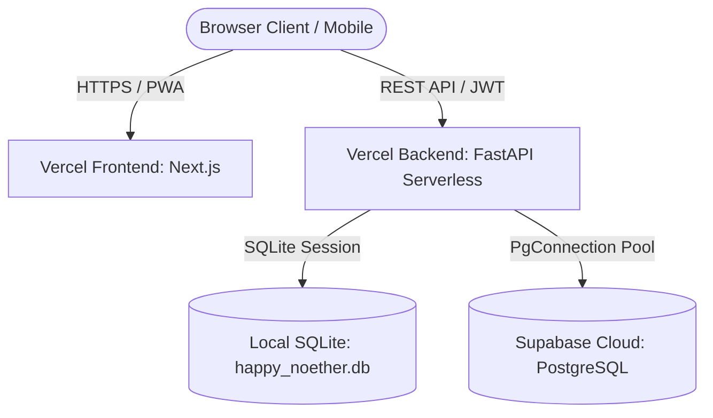

# H+H Food System: System Architecture Guide

This document describes the high-level technical architecture, database connections pool, API boundaries, and frontend patterns of the application.

---

## 🏗️ Architecture Blueprint

---

## 💻 Tech Stack & Frameworks

### 1. Frontend Client
* **Framework**: Next.js 16 (App Router, Turbopack).
* **Styling**: Tailwind CSS, Vanilla CSS.
* **Component Library**: Lucide Icons.
* **Charts Engine**: Recharts (Responsive bar charts and donut rings).
* **PWA Engine**: Service Worker `sw.js` for background push notifications, linked via `manifest.json`. The settings dashboard contains native registration diagnostics leveraging `navigator.serviceWorker.getRegistrations()`.

### 2. Backend API
* **Framework**: FastAPI (ASGI, Python).
* **ORM**: SQLAlchemy.
* **Security**: JWT (`PyJWT`), bcrypt cryptography (`bcrypt`).
* **Serverless Execution**: Vercel Python runtime threads.

---

## 🗄️ Database Connections & Session Management
The backend dynamically routes connections depending on the environment setup:
* **Local Override**: FastAPI checks if a local SQLite database file `happy_noether.db` exists in the backend directory.
* **Cloud PostgreSQL**: In production, the backend initiates connections using standard psycopg2 driver pools targeting Supabase PostgreSQL URI from `DATABASE_URL`.
* **Runtime identity**: `ENVIRONMENT=production` is configured in Vercel and exposed through the health check for operational verification.
* **Authentication secret**: Backend JWT signing requires `JWT_SECRET`; no misspelled fallback is supported.
* **N+1 Query Reduction**: All resource-heavy queries (e.g. consignment dispatches, invoices, and costing sheets) load relationships eagerly using `joinedload` and `selectinload` ORM options.
* **Transactional Safety**: Database writing endpoints verify validation rules (e.g. cycles in recipes, stock counts in production) in-memory before committing changes.
* **Database Backups**: Serializes all 31 database tables into a structured JSON payload. The FastAPI route decorator is mapped to `/backup` to align with the global prefix stripping middleware, which rewrites `/api/backup` to `/backup`.
* **Multi-Location Warehouses**: Stocks are distributed across warehouses using a junction mapping table (`warehouse_stocks`). The default "Main Facility" warehouse balances are bi-directionally synchronized with the primary `available_stock` and `warehouse_stock` fields in `raw_ingredients` and `product_skus` to preserve backwards compatibility for existing costing, production planners, and invoicing flows.
* **Web Push Notifications**: Leverages standard uncompressed Elliptic Curve public key parameters signed with VAPID protocols. Active browser client device endpoints are persisted inside `push_subscriptions`. Event triggers are hooked directly within transaction commits (e.g. low stock alerts on manual updates or automated production runs, and reseller sales), with dead or expired endpoints self-cleaned on failed webpush attempts.

---

This guide outlines the system design conventions and ensures developers can navigate connections pools easily.
