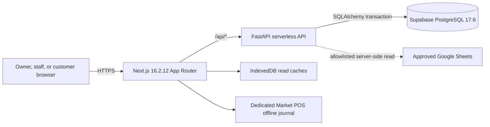

# H+H Hub — Architecture Guide

Version **2.6.1** is a same-origin Next.js and FastAPI application deployed through one Vercel project.

```mermaid
flowchart LR
    User["Owner, staff, or customer browser"]
    Next["Next.js 16.2.12 App Router"]
    API["FastAPI serverless API"]
    PG[("Supabase PostgreSQL 17.6")]
    Sheets["Approved Google Sheets"]
    Local["IndexedDB read caches"]
    POS["Dedicated Market POS offline journal"]

    User -->|HTTPS| Next
    Next -->|/api/*| API
    API -->|SQLAlchemy transaction| PG
    API -. allowlisted server-side read .-> Sheets
    Next --> Local
    Next --> POS
```

## Frontend

- Next.js App Router with Turbopack, React 19, Tailwind CSS v4, Recharts, and Lucide.
- Same-origin `/api` calls through the typed `frontend/src/lib/api.ts` boundary.
- SWR and local storage may cache read results for faster rendering.
- `frontend/src/lib/indexedDb.ts` exists only to sanitize the retired generic offline queue.
- `frontend/src/lib/marketEventOfflineDb.ts` owns the separate versioned Market POS journal.
- Public preorder visibility and positive-price checks are repeated by the backend.
- The sidebar reads the API application version and falls back to the frontend package version.

## Backend

- FastAPI `0.139.2`.
- SQLAlchemy `2.0.28`.
- All 45 models remain in `backend/app/models.py`.
- Dual-token authentication: short access token in memory and secure HttpOnly refresh cookie.
- Owner/staff boundaries are enforced in dependencies and response schemas.
- The `/version` endpoint exposes the canonical backend version and release timestamp.
- The `/health` endpoint verifies database access and reports the runtime environment.

## Database

- Local tests/development use isolated SQLite configurations.
- Production uses Supabase project `lstdqfvbhimqrhhgrnqy` in Singapore.
- Reviewed files under `supabase/migrations/` own the production schema.
- Production does not call `Base.metadata.create_all`.
- All 45 public tables have RLS enabled; service-role policies preserve the backend-only access model.
- Main Facility stock mirrors stay synchronized with ingredient `available_stock` and SKU `warehouse_stock` inside the mutation transaction.

## Financial and inventory consistency

- Reseller, consignment, and Market Event item rows record immutable price and cost snapshots.
- Market POS retries use `(event_id, client_reference)` idempotency.
- Production planning performs recursive BOM expansion, cycle detection, aggregate shortage validation, and FIFO batch consumption.
- Failed synchronization rolls back the whole mutation.
- Zero-quantity inventory ledger noise is not written.
- Public preorders reject inactive, hidden, non-current-line, and non-positive-price SKUs.

## Offline boundaries

The application does not have a generic offline mutation queue.

Online-only operations include:

- login and account administration;
- product, ingredient, warehouse, and batch mutations;
- reseller and consignment financial writes;
- event activation/completion and other administrative mutations;
- destructive or uncertain writes.

Market POS is the exception because it has a dedicated versioned package, stable client reference, local stock reservation, receipt comparison, serialized replay, and manual-review states.

## Google Sheets boundary

- Reads use a dedicated server-side service account with Viewer access.
- Vercel OIDC is exchanged through Google Workload Identity Federation for short-lived service-account tokens; no persistent Google key is stored.
- Spreadsheet IDs, tabs, ranges, identifiers, and destination fields must pass both environment and code allowlists.
- Every run stores immutable snapshots and auditable decisions.
- Destination version checks prevent silent last-write-wins behavior.
- Only retail and reseller prices may use owner-enabled auto-apply, and only inside the configured 25% safety band.
- Stock, production, payments, users, and historical transactions are never imported by the generic Sheet workflow.
- Missing identity settings, request OIDC token, or workbook sharing disables Sheet reads without affecting the rest of the Hub.

## Deployment and release

- Repository: `Aaron840588/H-H`
- Production branch: `main`
- Vercel project: `hh-hub`
- Alias: [https://hh-portal.vercel.app](https://hh-portal.vercel.app)
- Supabase project: `H+H SG`
- CI: `.github/workflows/quality.yml`

The release gate runs the frontend tests, production audit, lint, TypeScript, Next.js build, backend dependency audit, Python compilation, and complete backend suite.
